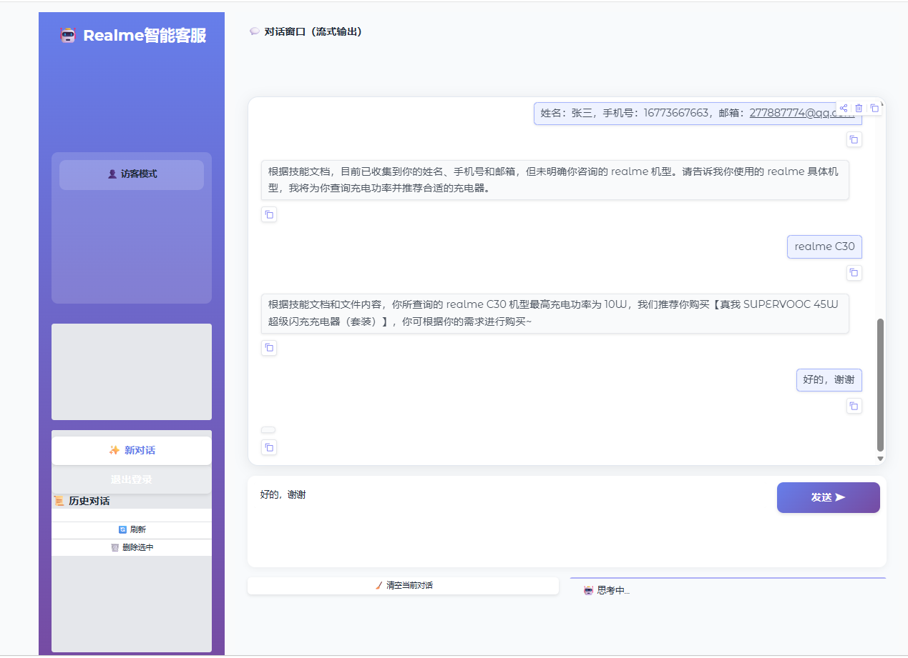

# 🤖 realme 智能客服系统

基于 AgentScope 框架的智能客服系统，支持 **单智能体+多技能架构** 和 **多智能体架构** 两种模式，为 realme 用户提供全方位的服务支持。

[](https://www.python.org/)
[](https://github.com/alibaba/AgentScope)
[](https://fastapi.tiangolo.com/)
[](LICENSE)

## 📋 目录

- [项目背景](#-项目背景)
- [架构设计](#-架构设计)
  - [单智能体+多技能架构](#模式一单智能体--多技能架构-agent--skills)
  - [多智能体架构](#模式二多智能体架构-orchestrator-workers)
  - [核心组件](#-核心组件)
- [功能模块](#-功能模块)
- [技术亮点](#-技术亮点)
- [项目结构](#-项目结构)
- [快速开始](#-快速开始)
- [API接口](#-api接口)
- [技能开发](#-技能开发)
- [依赖说明](#-依赖说明)

## 🎯 项目背景

随着智能客服需求的增长，传统系统难以应对复杂的多领域问题。本项目提供两种架构模式：

| 模式 | 描述 | 适用场景 |
|------|------|----------|
| 🎯 **单智能体 + 多技能架构** | 一个智能体通过动态加载技能模块处理不同业务场景 | 标准化、流程化的业务 |
| 🔄 **多智能体架构** | 调度智能体动态创建专业 Worker，适合复杂问题的自动拆解和并行处理 | 复杂多领域问题 |

## 🏗️ 架构设计

### 模式一：单智能体 + 多技能架构 (Agent + Skills)

```
┌─────────────────────────────────────────────────────────────────────────┐
│                                                                         │
│                     🤖 Single Agent (Friday)                           │
│                                                                         │
│          职责：识别意图 → 加载技能 → 执行流程 → 返回结果                   │
│                                                                         │
└─────────────────────────────────────────────────────────────────────────┘
                                    │
                                    │ view_text_file
                                    │ 读取技能文档
                                    ▼
┌─────────────────────────────────────────────────────────────────────────┐
│                           📚 Skills Library                             │
├─────────────┬─────────────┬─────────────┬─────────────┬─────────────────┤
│             │             │             │             │                 │
│ 🔧 维修进度 │ 📍 服务网点 │   ⚡ 充电器  │💰 订单价保  │  ✅ 产品真伪    │
│  SKILL.md   │  SKILL.md   │  SKILL.md   │  SKILL.md   │  SKILL.md       │
│             │             │             │             │                 │
├─────────────┼─────────────┼─────────────┼─────────────┼─────────────────┤
│             │             │             │                               │
│📦 订单物流  │  🏷️ 价格折扣 │  📅 预约维修│        ... 更多技能           │
│  SKILL.md   │  SKILL.md   │  SKILL.md   │                               │
│             │             │             │                               │
└─────────────┴─────────────┴─────────────┴─────────────┴─────────────────┘
```

**✨ 特点：**
- 📝 技能与智能体解耦，通过 `SKILL.md` 定义业务流程
- 🔄 智能体运行时动态读取技能文档
- 📐 统一的技能定义格式，便于维护和扩展
- 🧩 新增技能只需创建目录和 SKILL.md 文件

---

### 模式二：多智能体架构 (Orchestrator-Workers)

```
┌─────────────────────────────────────────────────────────────────────────┐
│                                                                         │
│                    🎭 Orchestrator Agent                                │
│                                                                         │
│         职责：分析问题 → 拆解任务 → 动态创建Worker → 汇总结果               │
│                                                                          │
└─────────────────────────────────────────────────────────────────────────┘
                                    │
                                    │ Tool Calls
                                    │ (动态创建Worker)
                                    ▼
┌─────────────────────────────────────────────────────────────────────────┐
│                           👷 Workers Pool                               │
├───────────┬───────────┬───────────┬───────────┬───────────┬─────────────┤
│           │           │           │           │           │             │
│🔧 Repair │ 📍 Service│ ⚡ Charger│ 💰 Price │ 📦 Order  │ 🏷️ Discount │
│  Worker   │  Worker   │  Worker   │ Protect   │  Status   │   Worker    │
│  (维修)   │  (网点)    │  (充电器)  │  Worker  │  Worker   │   (折扣)     │
│           │           │           │  (价保)   │  （物流）  │             │
├───────────┼───────────┼───────────┼───────────┼───────────┼─────────────┤
│           │           │                                                 │
│ ✅ Authen │           │           ⇄ 支持 Worker 并行调用 ⇄             │
│ ticity    │   ...     │   ...                                           │
│  Worker   │           │           ⇄ 结果回传 Orchestrator ⇄             │
│  (真伪)    │           │                                                │
│           │           │                                                 │
└───────────┴───────────┴───────────┴───────────┴───────────┴─────────────┘
```

**✨ 特点：**
- 🎭 Orchestrator 智能调度，Worker 专业处理
- 🔧 支持多 Worker 并行调用（parallel_tool_calls）
- ⚡ 适合复杂多领域问题
- 🧩 新增功能只需添加 Worker 创建函数

---

### 🔧 核心组件

```
┌─────────────────────────────────────────────────────────────────────────┐
│                              🏗️ 核心组件架构                             │
└─────────────────────────────────────────────────────────────────────────┘

┌─────────────────────┐     ┌─────────────────────┐     ┌─────────────────────┐
│   🤖 ReActAgent     │     │   🧠 Memory System │    │   🔌 Toolkit         │
├─────────────────────┤     ├─────────────────────┤     ├─────────────────────┤
│                     │     │                     │     │                     │
│  • 推理-行动循环     │     │  • 短期记忆          │     │  • 工具注册管理      │
│  • 工具调用          │────▶│  • 线程隔离         │◀────│  • MCP 工具集成     │
│  • 结构化输出        │     │  • 过期清理          │     │  • 动态工具加载      │
│  • 流式响应          │     │  • 长期记忆支持      │     │                     │
│                     │     │                     │     │                     │
└─────────────────────┘     └─────────────────────┘     └─────────────────────┘
          │                         │                         │
          │                         │                         │
          ▼                         ▼                         ▼
┌─────────────────────┐     ┌─────────────────────┐     ┌─────────────────────┐
│   💬 OpenAIChat    │      │   🗄️ Database      │     │   📝 Skills        │
│   Model             │     │                     │     │                     │
├─────────────────────┤     ├─────────────────────┤     ├─────────────────────┤
│                     │     │                     │     │                     │
│  • 流式/非流式       │     │  • SQLite 存储      │      │  • SKILL.md 定义    │
│  • 多模型支持        │     │  • 用户管理         │      │  • 技能文档管理      │
│  • API 兼容          │    │  • 会话管理          │     │  • 动态加载          │
│  • 缓存支持          │     │  • 消息记录         │      │                     │
│                     │     │                     │     │                     │
└─────────────────────┘     └─────────────────────┘     └─────────────────────┘

┌─────────────────────────────────────────────────────────────────────────┐
│                              🌐 服务层                                  │
├───────────────────────┬───────────────────────┬─────────────────────────┤
│   🚀 FastAPI 服务     │   🖥️ Gradio 演示      │   📡 MCP 服务          │
│                       │                       │                         │
│  • /v1/chat/completions│  • Web UI 界面        │  • 服务网点查询          │
│  • /clear             │  • 流式对话演示        │  • 预约维修              │
│  • /api/auth/*        │  • 多轮对话支持        │  • 标准协议集成          │
│  • OpenAI 兼容格式     │                       │                         │
└───────────────────────┴───────────────────────┴─────────────────────────┘
```

#### 组件说明

| 组件 | 文件 | 职责 |
|------|------|------|
| **ReActAgent** | `agentscope.agent` | 推理-行动循环，工具调用，结构化输出 |
| **Memory System** | `core/memory_manager.py` | 线程隔离记忆，过期清理，持久化存储 |
| **Toolkit** | `agentscope.tool` | 工具注册，MCP 集成，动态加载 |
| **OpenAIChat Model** | `agentscope.model` | 模型调用，流式响应，API 兼容 |
| **Database** | `database/` | SQLite 存储，用户/会话管理 |
| **Skills** | `skills/` | 技能定义，动态加载，流程控制 |
| **FastAPI 服务** | `main.py`, `main_agent_skill.py` | REST API，OpenAI 兼容接口 |
| **MCP 服务** | `./skills/find-service-center/mcp_server.py` | Model Context Protocol 集成 |

---

### 📊 两种模式对比

| 特性 | 🎯 单智能体+多技能 | 🔄 多智能体 |
|------|------------------|-------------|
| 入口文件 | `main_agent_skill.py` | `main.py` |
| 架构复杂度 | ⭐ 简单 | ⭐⭐⭐ 较高 |
| 技能定义 | SKILL.md 文件 | Worker 系统提示词 |
| 扩展方式 | 新增技能目录 | 新增 Worker 创建函数 |
| 适用场景 | 标准化流程业务 | 复杂多领域问题 |
| 并行处理 | ❌ 不支持 | ✅ 支持 |
| 调试难度 | ⭐ 简单 | ⭐⭐ 中等 |
| 响应速度 | ⭐⭐⭐ 快 | ⭐⭐ 中等 |

## 🌟 功能模块

| 模块 | 图标 | 功能描述 | 支持模式 |
|------|------|----------|----------|
| 维修进度查询、预约维修 | 🔧 | 查询维修订单状态、预计完成时间 、创建到店维修预约| 单智能体 / 多智能体 |
| 服务网点查询 | 📍 | 查询服务网点地址、电话、营业时间 | 单智能体 / 多智能体 |
| 充电器推荐 | ⚡ | 根据机型推荐适配充电器 | 单智能体 / 多智能体 |
| 订单价保 | 💰 | 查询订单价保信息、降价补差 | 单智能体 / 多智能体 |
| 订单物流 | 📦 | 查询订单状态、物流信息 | 单智能体 / 多智能体 |
| 价格折扣 | 🏷️ | 查询产品价格、优惠活动 | 单智能体 / 多智能体 |
| 产品真伪 | ✅ | IMEI 真伪验证、保修查询 | 单智能体 / 多智能体 |

## 💡 技术亮点

### 1. 🔄 双架构支持
- **单智能体+技能架构**：轻量级、易维护、适合标准化业务
- **多智能体架构**：复杂问题拆解、并行处理、动态调度

### 2. 🧠 基于 AgentScope 框架
- 使用 ReActAgent 实现推理-行动循环
- 内置工具调用和记忆管理
- 流式输出支持
- 结构化输出能力

### 3. 📝 技能系统 (Skills)
- 🧩 可插拔的技能模块，通过 `SKILL.md` 定义业务流程和话术
- 🔄 智能体运行时动态读取技能文档
- 📐 标准化的技能定义格式（YAML Front Matter + Markdown）
- 💬 支持多轮对话流程控制

### 4. 🔌 MCP (Model Context Protocol) 集成
- 支持外部 MCP 服务扩展
- 实现服务网点查询的 MCP 服务端
- 标准化工具协议

### 5. 🧵 线程隔离记忆管理
- 每个会话线程拥有独立的记忆空间
- 自动清理过期记忆（可配置时间）
- 支持 SQLite 持久化存储
- 支持长期记忆检索（memory 参数）

### 6. 🌊 流式响应
- 支持 SSE (Server-Sent Events) 流式输出
- 增量文本推送，提升用户体验
- OpenAI 兼容格式

### 7. 🔐 用户认证系统
- JWT Token 认证
- 用户注册/登录
- 会话管理

## 📁 项目结构

```
realme_agent/
├── 📁 core/                                      # 核心模块
│   ├── 📄 agent_setup.py                         # 智能体初始化
│   ├── 📄 multi_agent_service.py                 # 多智能体服务（Orchestrator-Workers）
│   ├── 📄 memory_manager.py                      # 记忆管理（线程隔离）
│   └── 📄 middleware.py                          # 按需加载工具中间件
├── 📁 tools/                                     # 工具函数
│   ├── 📄 repair.py                              # 维修进度查询工具
│   ├── 📄 price_protect.py                       # 订单价保查询工具
│   ├── 📄 authenticity.py                        # 产品真伪查询工具
│   ├── 📄 logistics.py                           # 订单物流查询工具
│   └── 📄 discount.py                            # 价格折扣查询工具
├── 📁 skills/                                    # 技能模块（单智能体模式）
│   ├── 📁 realme-repair-progress/                # 维修进度查询技能
│   │   └── 📄 SKILL.md
│   ├── 📁 find-service-center/                   # 服务网点查询技能
│   │   └── 📄 SKILL.md
│   ├── 📁 realme-charger-advisor/                # 充电器推荐技能
│   │   └── 📄 SKILL.md
│   ├── 📁 realme-order-price-protection/         # 订单价保查询技能
│   │   └── 📄 SKILL.md
│   ├── 📁 order-status-query/                    # 订单物流查询技能
│   │   └── 📄 SKILL.md
│   ├── 📁 realme-price-discount-query/           # 价格折扣查询技能
│   │   └── 📄 SKILL.md
│   └── 📁 realme-product-authenticity-and-warranty-query/  # 产品真伪查询技能
│       └── 📄 SKILL.md
├── 📁 database/                                  # 数据库模块
│   ├── 📄 db.py                                  # 数据库连接配置
│   ├── 📄 crud.py                                # CRUD 操作
│   └── 📄 migrations.py                          # 数据库迁移
├── 📁 utils/                                     # 工具模块
│   └── 📄 stream_utils.py                        # 流式响应工具
├── 📁 test/                                      # 测试文件
│   ├── 📄 http_stream.py                         # HTTP 流式测试
│   ├── 📄 http_non_stream.py                     # HTTP 非流式测试
│   ├── 📄 openai_stream.py                       # OpenAI SDK 流式测试
│   └── 📄 openai_non_stream.py                   # OpenAI SDK 非流式测试
├── 📄 main.py                                    # 🔄 多智能体模式入口
├── 📄 main_agent_skill.py                        # 🎯 单智能体模式入口
├── 📄 gradio_app.py                              # 🖥️ Gradio 演示界面（非流式）
├── 📄 gradio_app_stream.py                       # 🖥️ Gradio 演示界面（流式）
├── 📄 config.py                                  # ⚙️ 配置文件
├── 📄 .env                                       # 🔐 环境变量
└── 📄 requirements.txt                           # 📦 依赖列表
```

## 🚀 快速开始

### 1. 📋 环境配置
```bash
conda create -n agentscope python==3.11
conda activate agentscope
```

### 2. 📦 安装依赖

```bash
pip install -r requirements.txt
```

### 3. ⚙️ 配置环境变量

创建 `.env` 文件：

```env
# Doubao (ByteDance) API Configuration
DOUBAO_API_KEY=your_api_key
DOUBAO_BASE_URL=https://ark.cn-beijing.volces.com/api/v3
DOUBAO_MODEL=doubao-1-5-pro-32k-250115

# DashScope (Alibaba Qwen) API Configuration
DASHSCOPE_API_KEY=your_dashscope_key
DASHSCOPE_MODEL=qwen3-max

```

### 4. 🏃 启动服务

**🎯 单智能体+技能模式：**
```bash
python main_agent_skill.py
# 服务地址: http://localhost:8001
```

**🔄 多智能体模式：**
```bash
python main.py
# 服务地址: http://localhost:8001
```

**🖥️ Gradio 演示界面：**
```bash
python gradio_app.py          # 多智能体模式
python gradio_app_stream.py   # 流式响应模式
```


### 5. 🧪 测试

```bash
# 流式测试
python test/http_stream.py --thread test_001
python test/openai_stream.py --thread test_001

# 非流式测试
python test/http_non_stream.py --thread test_001
python test/openai_non_stream.py --thread test_001

# 带长期记忆测试
python test/http_stream.py --memory "用户ID:user_2,姓名：张三，手机号：16773667663，邮箱：277887774@qq.com"

python test/openai_stream.py --memory "用户ID:user_2,姓名：张三，手机号：16773667663，邮箱：277887774@qq.com"
```

## 📡 API 接口

启动后访问 `http://localhost:8001`

### 核心接口

| 接口 | 方法 | 描述 |
|------|------|------|
| `/v1/chat/completions` | POST | 对话接口（OpenAI 兼容格式） |
| `/clear` | POST | 清空线程记忆 |

### 用户认证接口

| 接口 | 方法 | 描述 |
|------|------|------|
| `/api/auth/register` | POST | 用户注册 |
| `/api/auth/login` | POST | 用户登录 |
| `/api/auth/me` | GET | 获取当前用户信息 |

### 会话管理接口

| 接口 | 方法 | 描述 |
|------|------|------|
| `/api/conversations` | GET | 获取用户对话列表 |
| `/api/conversations` | POST | 创建新对话 |
| `/api/conversations/{id}` | DELETE | 删除对话 |
| `/api/conversations/{id}/messages` | GET | 获取对话消息 |

### 请求示例

```bash
# 流式对话
curl -X POST http://localhost:8001/v1/chat/completions \
  -H "Content-Type: application/json" \
  -d '{
    "model": "doubao-pro-1.5",
    "messages": [{"role": "user", "content": "你好"}],
    "stream": true,
    "thread": "test_thread",
    "memory": "用户之前咨询过维修问题"
  }'

# 非流式对话
curl -X POST http://localhost:8001/v1/chat/completions \
  -H "Content-Type: application/json" \
  -d '{
    "model": "doubao-pro-1.5",
    "messages": [{"role": "user", "content": "你好"}],
    "stream": false,
    "thread": "test_thread"
  }'
```

## 🛠️ 技能开发

### 技能目录结构
```
skill-name/
├── 📄 SKILL.md          # 技能定义文件（必需）
├── 📄 data.json         # 数据文件（可选）
```

### SKILL.md 格式

技能文件采用 YAML Front Matter + Markdown 格式：

```markdown
---
name: skill-name
description: 技能描述，用于意图匹配
---

# 技能标题

## 技能概述
技能的整体功能说明

## 依赖工具
本技能需要调用的工具列表及说明

## 执行流程
### 1. 触发判断
触发条件和意图识别规则

### 2. 步骤一
具体执行步骤和话术

### 3. 步骤二
...

## 标准输出格式（必须严格使用）
结果输出模板

## 异常与兜底处理
各种异常情况的处理方式

## 执行约束
必须遵守的规则
```

### 技能加载流程

1. 🎯 智能体识别用户意图
2. 📄 通过 `view_text_file` 读取匹配的 `SKILL.md`
3. ⚙️ 按照技能定义的流程执行
4. 🔧 调用依赖工具获取数据
5. 📤 按标准格式输出结果

### 新增技能步骤

1. 在 `skills/` 目录下创建技能目录
2. 编写 `SKILL.md` 文件
3. 在 `tools/` 中实现依赖工具（如有需要）
4. 重启服务即可生效

## 📚 依赖说明

| 依赖 | 版本 | 用途 |
|------|------|------|
| 🤖 agentscope | 1.0.18 | 多智能体框架 |
| ⚡ fastapi | 0.135.3 | Web 框架 |
| 🔥 uvicorn | 0.44.0 | ASGI 服务器 |
| 🖥️ gradio | 6.13.0 | 演示界面 |
| 🗄️ sqlalchemy | 2.0.49 | ORM 框架 |
| 🔐 python-jose | 3.5.0 | JWT 认证 |
| 🔒 passlib | 1.7.4 | 密码加密 |
| 🌐 httpx | 0.28.1 | HTTP 客户端 |
| ⚙️ python-dotenv | 1.2.2 | 环境变量管理 |

## 📄 许可证

[MIT License](LICENSE)

---

